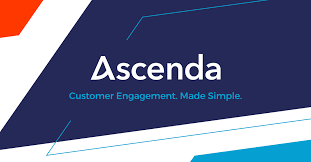

<!-- PROJECT LOGO -->
 

  

  

    This outlines the project codebase for AY2023/2024 Semester 1 CS301  - G1T1 
  

<!-- TABLE OF CONTENTS -->

  
Table of Contents

  <ol>
    <li>
      <a href="#a">About the Project</a>
    </li>
    <li>
      <a href="#testing-the-project">Testing the Project</a>
      <ul>
        <li><a href="#configuring-backend">Listing Users</a></li>
	<li><a href="#prerequisites">Enrolling new Users</a></li>
	<li><a href="#prerequisites">Updating User Infromation</a></li>
	<li><a href="#prerequisites">Deleting User Infromation</a></li>
      </ul>
    </li>
    <li><a href="#acknowledgments">Acknowledgments</a></li>
  </ol>

<!-- ABOUT THE PROJECT -->

## About The Project

Our project consists of three backend applications which are the `User Storage ` mircoservice which allow user to list user,enroll new user and update and delete user information.It also consists of the `Point Ledger` microservice which allow user to query point balance of an user and adjust balance of their points account. Lastly we have the `Admin Proxy` application which acts as a gateway betweeen the client and the two applications stated above.

	
## Testing the Project

## Creating a User

<!-- ACKNOWLEDGMENTS -->

## Acknowledgments

* [Calista Lee Yen Ling](https://github.com/cal-lee)
* [Eng T-Leng](https://github.com/T-Leng)
* [Tan Yi Peng](https://github.com/tanyipeng834)
* [Tim Mo Seng](https://github.com/MoSengT)
* [Wu Hao](https://github.com/wuhao212)
* [Yong Lip Khim](https://github.com/JermYong)

(<a href="#top">back to top</a>)

