<!-- PROJECT LOGO -->
 

  

  

    This outlines the project codebase for AY2023/2024 Semester 1 CS301  - G1T1 
  

<!-- TABLE OF CONTENTS -->

  
Table of Contents

  <ol>
    <li>
      <a href="#a">About the Project</a>
    </li>
    <li>
      <a href="#getting-started">Getting Started</a>
      <ul>
        <li><a href="#listing-users">Listing Users</a></li>
        <li><a href="#enrolling-new-users">Enrolling new Users</a></li>
        <li><a href="#updating-new-users">Updating User Infromation</a></li>
        <li><a href="#deleting-usersdeleting-users">Deleting User Infromation</a></li>
        <li><a href="view-all-companies">View All Companies</a></li>
        <li><a href="view-all-users-in-company">View all Users Under A Company</a></li>
        <li><a href="edit-points">Edit Points</a></li>
        <li><a href="view-all-accounts">Viewing All Accounts Under A Particular Company</a></li>
        <li><a href="add-points-accounts">Add Points Account For A Particular User</a></li>
	      <li><a href="update-permissions-for-users">Updating Permissions for Users</a></li>
	      <li><a href="maker-checker-update-points">Maker Checker Update Points</a></li>
	      <li><a href="maker-checker-update-user-details">Maker Checker Update User Details</a></li>
      </ul>
    </li>

  </ol>

<!-- ABOUT THE PROJECT -->

## About The Project

Our project consists of three backend applications which are the `User Storage ` mircoservice which allow user to list user,enroll new user and update and delete user information.It also consists of the `Point Ledger` microservice which allow user to query point balance of an user and adjust balance of their points account. Lastly we have the `Admin Proxy` application which acts as a gateway betweeen the client and the two applications stated above.

	
## Getting Started

1.  Navigate to our hosted website on this [Application Link](https://api.itsag1t1.com/)
2.  We have created an account for our Professors Yeow Leong and Eng Lieh with these two respective emails `yllee@smu.edu.sg` and `elouh@smu.edu.sg`
4.  Click on the `Sign in with Google button`
## Listing Users

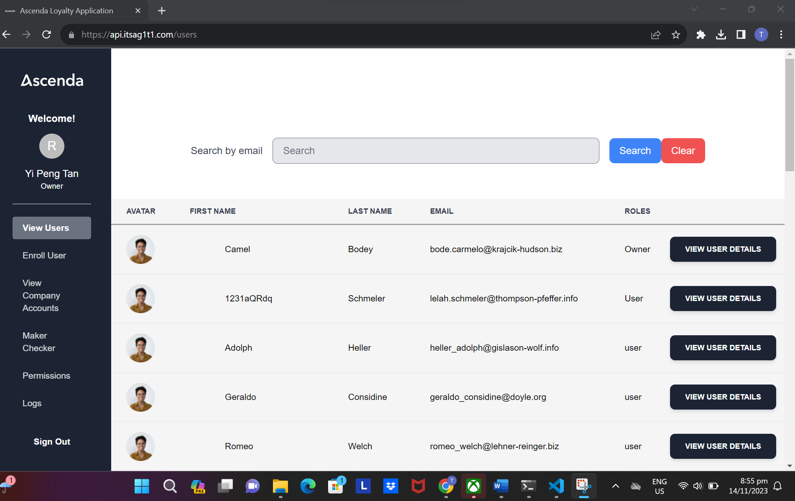

Upon Signing in as an user, the user will be greeted with all the users that is in the Ascenda Loyalty Application Database

## Enrolling New Users

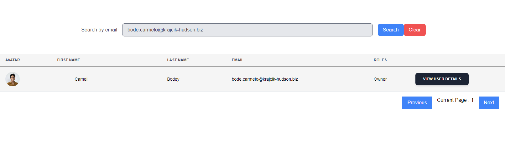
<ol>
	<li>User will navigate to the <b>Enroll User<b> tab on the sidebar</li>
	<li>After inputting the user details,the system would navigate back to the user listing page</li>
	<li>To verify the user has been added, please enter the exact email in the search bar, and the new user will be returned</li>
</ol>

## Updating New Users

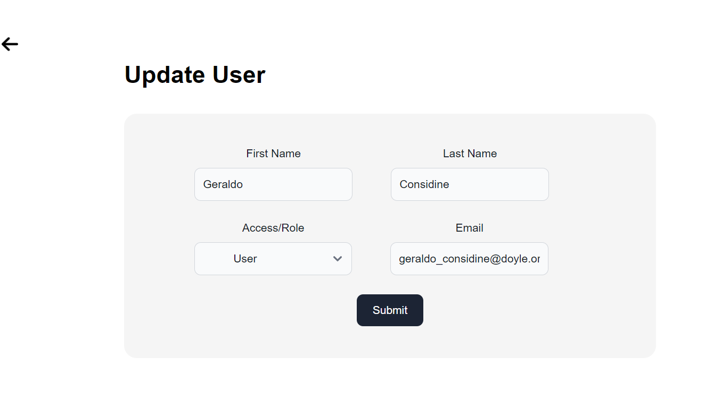
<ol>
	<li>User will navigate to the <b>Update User Details button<b> by clicking on the View User Details Button</li>
	<li>After inputting the new user details, the user would be navigated back to the users listings page</li>
	<li>The user should see a change in the user details on the user listing page</li>
</ol>

  
## Deleting Users

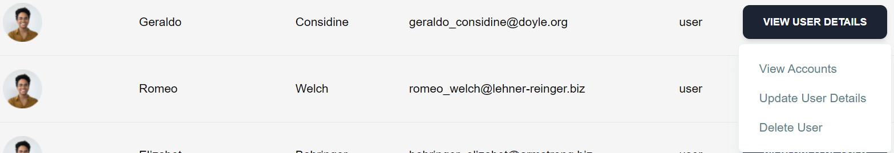
<ol>
	<li>User will navigate to the <b>Delete User <b> by clicking on the View User Details Button</li>
	<li>After pressing the Delete User button , the user would not appear on the user listing page</li>
	
</ol>

## Viewing All Companies

  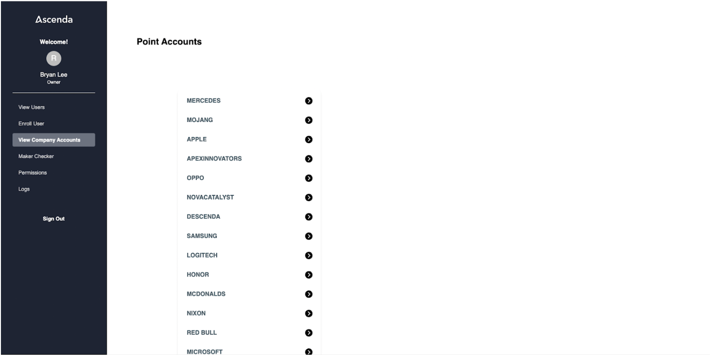
  <ol>
    <li>Navigate to the <b>View Company Accounts</b> tab</li>
  </ol>

## Viewing All Users Under A Company

  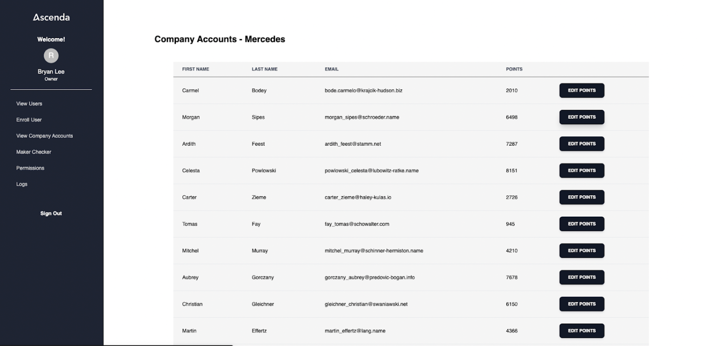
  <ol>
    <li>After pressing on a company, the user would see all the users, along with their information and number of points in their account under the company</li>
  </ol>

## Edit Points Of A Particular User Under A Particular Company

  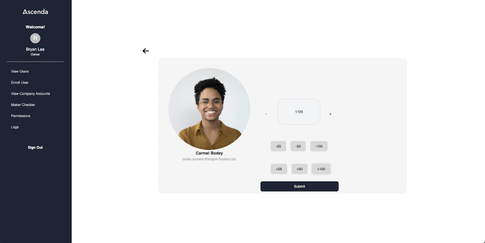
  <ol>
    <li>After clicking on <b>Edit Points</b> for a particular user, the user can edit the amount of points of the selected user</li>
  </ol>

## Viewing All Accounts under A Particular Company

  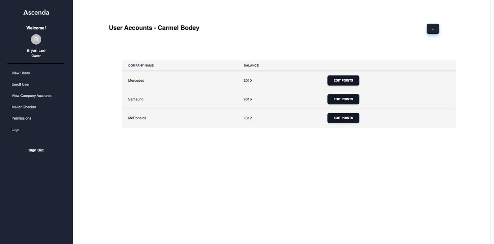
  <ol>
    <li>User will navigate to the <b>View Users</b> tab</li>
    <li>After clicking on <b>View User Details</b> button, user will navigate to <b>View Accounts</b></li>
  </ol>

## Add Points Account For A Particular User

  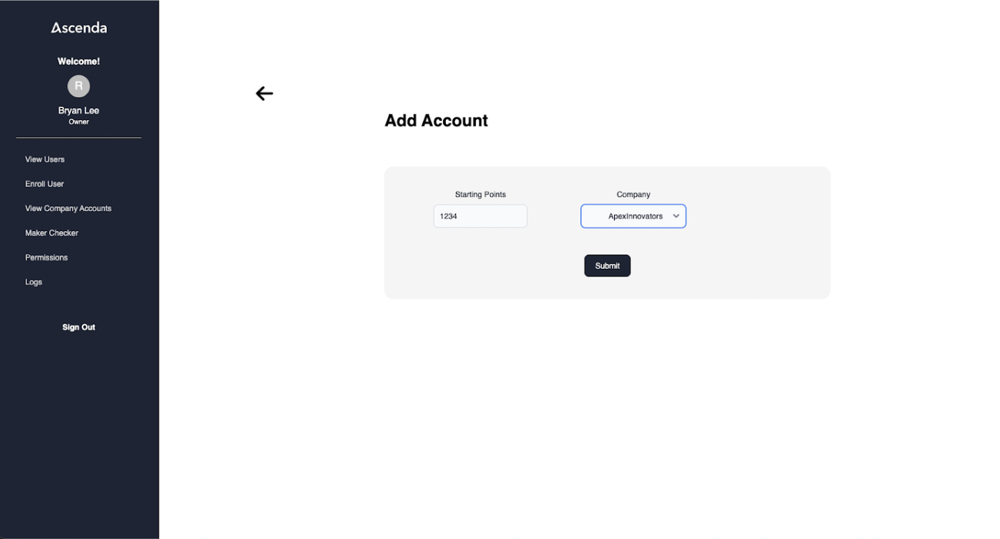
  <ol>
    <li>After clicking on <b>Edit Points</b> for a particular user, the user can edit the amount of points of the selected user</li>
  </ol>

## Update Permission for Users

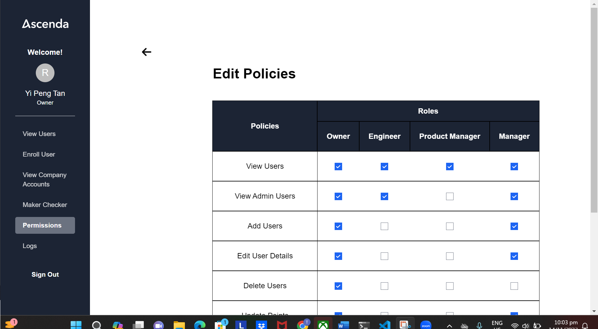
<ol>
	<li>Admin will be able to update permission for the roles specified</li>
	<li>After unchecking the <b>Add User<b> permission for Owner , and then navigating to the enroll user tab</li>
 	<li>The current User who has the Owner permisson, would then have an unauthoized page and not allowed to enroll users</li>
	
</ol>

## Maker Checker Update Points

  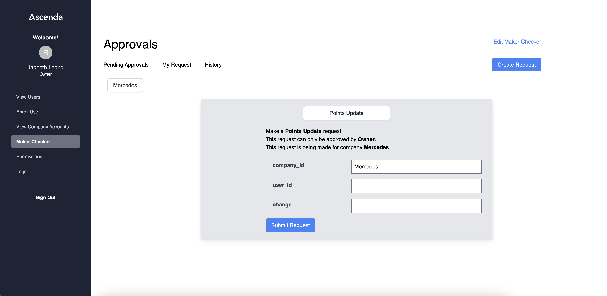
  <ol>
    <li>Go to <b>View Users<b> tab</li>
    <li>Choose any user, take note of the user (may want to take note of email for easy search later on) and click on "View User Details" > "View Accounts"</li>
    <li>Choose any company that they are with, take note of their point balance with that company, copy User ID</li>
    <li>Navigate to <b>Maker Checker<b> tab </li>
    <li>Select Company that you chose in step 3</li>
    <li>Click "Create Request"</li>
    <li>Click "Select an action" and select "Points Update"</li>
    <li>Fill in "user_id" with the user ID copied in step 3</li>
    <li>Fill in "change" with the amount that you want the point balance to change by (e.g. if you want to increase by 100 input 100, if you want to decrease by 100 input -100)</li>
    <li>Click "Submit Request" (will throw an error if you choose a user that does not have an account with that company)</li>
    <li>Log in to a different account (necessary because the person that created the request should not be able to approve it)</li>
    <li>Navigate to "Maker Checker" tab</li>
    <li>Select the same company as earlier</li>
    <li>Approve request</li>
    <li>Navigate to "View Users" tab</li>
    <li>Find the same user as in step 2 (you may use the search function by typing their email into the search bar)</li>
    <li>Click on "View User Details" > "View Accounts"</li>
    <li>Verify if that the point total for the chosen company has changed</li>
  </ol>

## Maker Checker Update User Details

  
  <ol>
    <li>Go to "View Users" tab</li>
    <li>Choose any user, take note of their email</li>
    <li>Navigate to "Maker Checker" tab</li>
    <li>Choose any company that you want to make the change on behalf of </li>
    <li>Enter "firstName", "lastName", "role" (can be multiple roles separated by commas without spaces. e.g. User,Owner,Admin) as you wish to change.</li>
    <li>Enter email that was noted in step 2</li>
    <li>Click "Submit Request"</li>
    <li>Log in to a different account (necessary because the person that created the request should not be able to approve it)</li>
    <li>Navigate to "Maker Checker" tab</li>
    <li>Select company that you created the request under</li>
    <li>Approve request</li>
    <li>Navigate to "View Users" tab</li>
    <li>Find the same user as in step 2 (you may use the search function by typing their email into the search bar)</li>
    <li>Verify that their first name, last name and role have changed</li>
  </ol>

<!-- ACKNOWLEDGMENTS -->

(<a href="#top">back to top</a>)

