# Deployment Guide

The deployment steps are listed below, and can be performed in any new AWS region or account. Please set up the following resources in sequence to allow for smoother deployment experience.

## SQS Setup
1) Create a Dead Letter Queue
2) Create a second Queue to be the main queue
3) Assign first queue to be dead letter queue for the main queue
  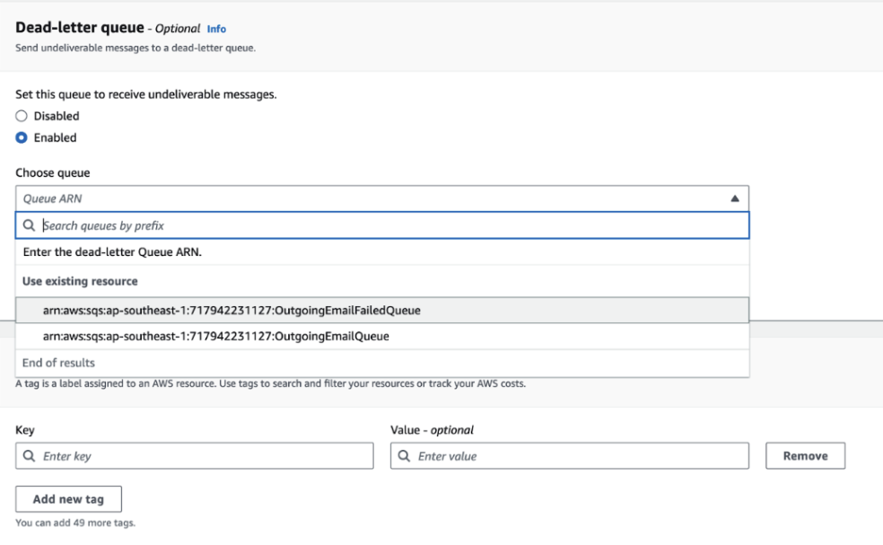
4) Take Note of the ARN and URL from the details tab
   
## Set up SES
1) Create email identity from SES
  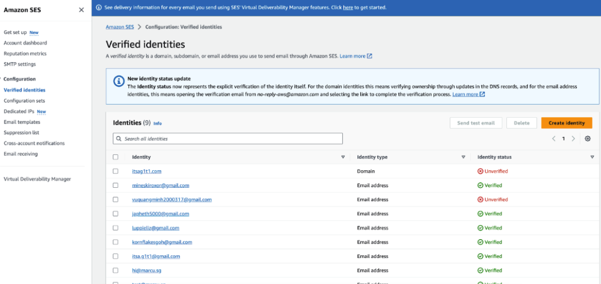
2) Verify that email identity
  
## Create Lambda Function to send email From SQS
1) Create a new Lambda Function
2) Set runtime to Python 3.10
3) Change default execution role and select “Create a new role from AWS policy templates”
4) Select “Amazon SQS poller permissions” under Policy templates
5) Create function
  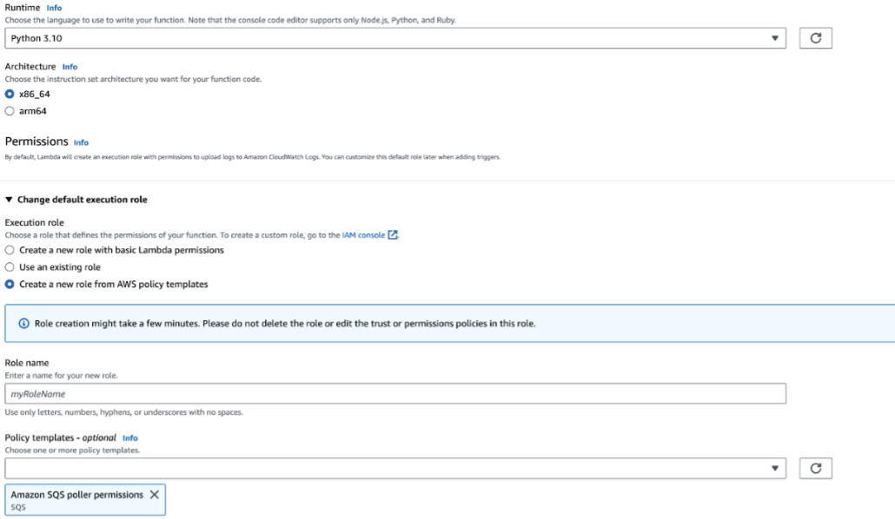
6) Furnish code source with the following code snippet
  ```
  import json
  import boto3
  from botocore.exceptions import ClientError


  def lambda_handler(event, context):
      
      emailData = event['Records'][0]["messageAttributes"]

      NAME = emailData['fromName']['stringValue']
      SENDER = NAME + " <insert SES verified email>"
      RECIPIENT = emailData['toEmail']['stringValue'].split(',')
      SUBJECT = emailData['subject']['stringValue']
      CHARSET = "UTF-8"
      
      DESTINATION =   {
                          'ToAddresses': 
                              RECIPIENT
                      }
                      
      AWS_REGION = "<insert region here as string>"
      
      
      BODY_HTML = (“<insert HTML here as string>”)

      BODY_TEXT = (“<insert text as string for recipients with no HTML capabilities>”)         

      client = boto3.client('ses',region_name=AWS_REGION)
      
      try:
          response = client.send_email(
              Destination = DESTINATION,
              Message={
                  'Body': {
                      'Html': {
                          'Charset': CHARSET,
                          'Data': BODY_HTML,
                      },
                      'Text': {
                          'Charset': CHARSET,
                          'Data': BODY_TEXT,
                      },
                  },
                  'Subject': {
                      'Charset': CHARSET,
                      'Data': SUBJECT,
                  },
              },
              Source=SENDER
          )
      except ClientError as e:
          print(e.response['Error']['Message'])
      else:
          print("Email sent! Message ID:")
          print(response['MessageId'])
          print(RECIPIENT)
      
      return {
          'statusCode': 200,
          'body': json.dumps(response)
      }
  ```

## Create VPC and subnets
1) Create Project VPC with default configuration using "VPC and More", with 2 AZ, 2 Public and Private Subnets and 1 NAT Gateway per AZ and no VPC Endpoint.
  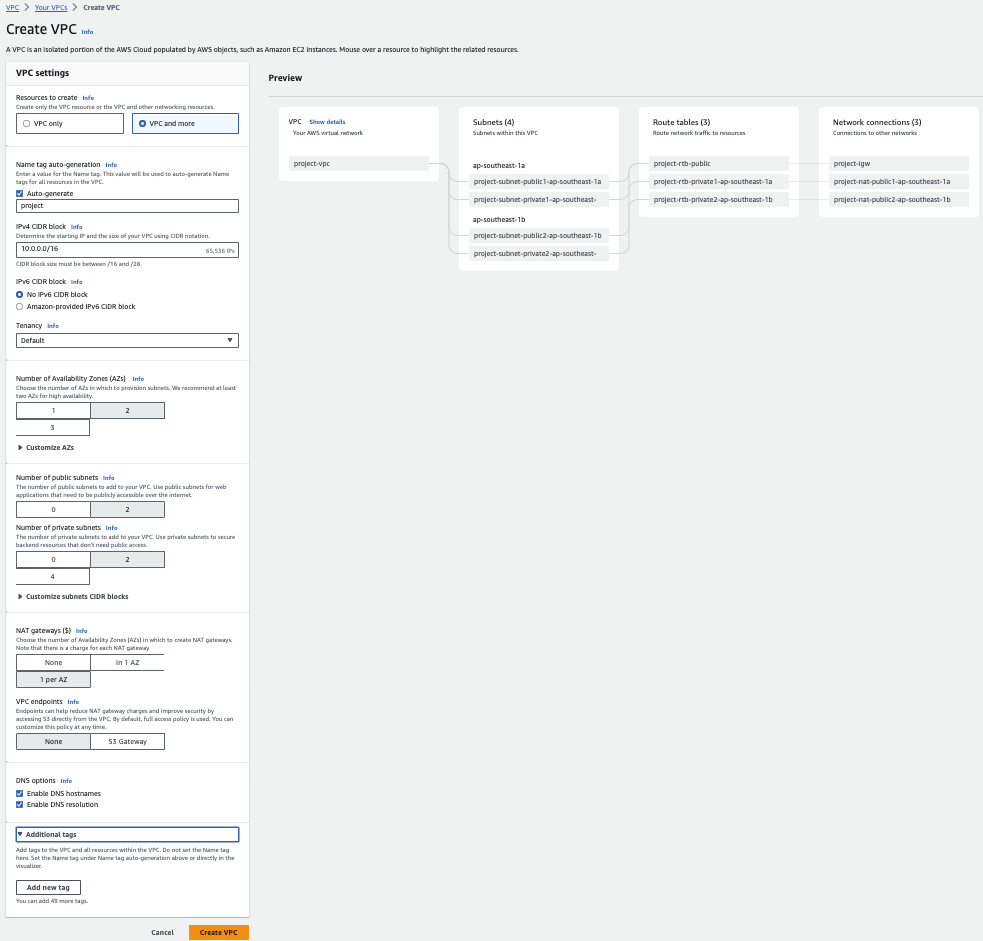

## Create VPC Endpoint for DynamoDB
1) Create a VPC Endpoint for Accessing DynamoDB through our Project VPC
  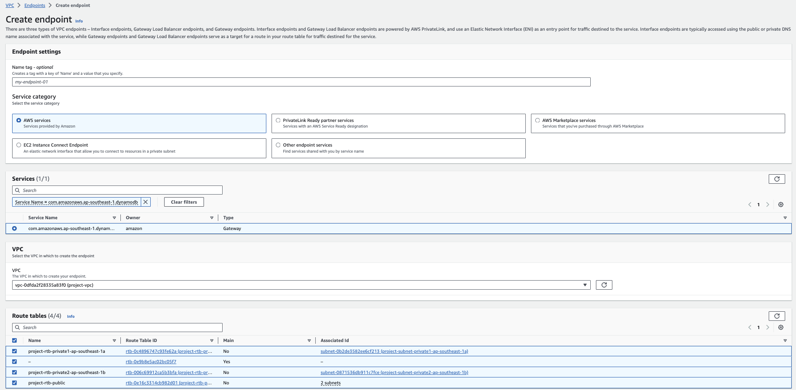

## Create Security Groups
1) Network Load Balancer:
  - Inbound:
    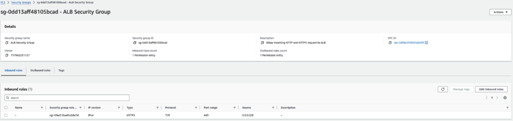
  - Outbound:
    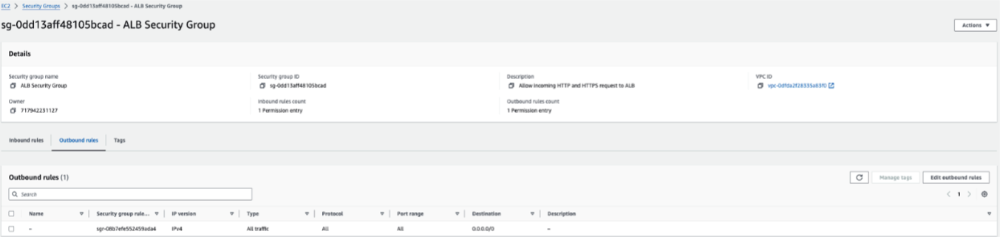

2) Micro Services:
  - Inbound:
    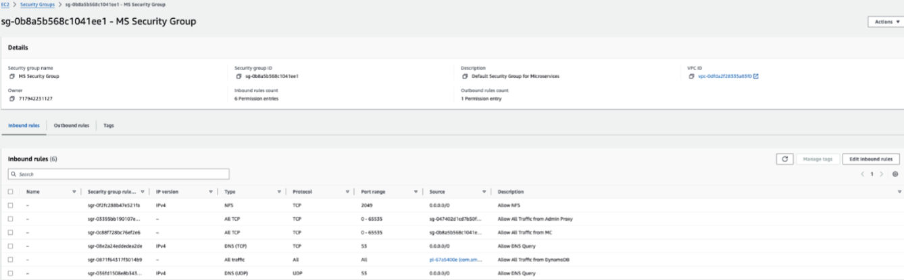
  - Outbound:
    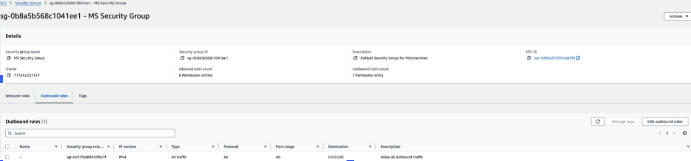

3) Admin Proxy Service:
  - Inbound:
    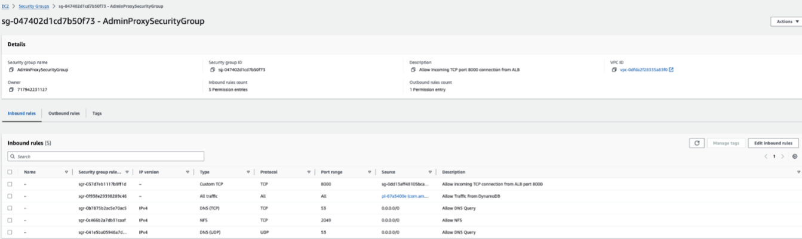
  - Outbound:
    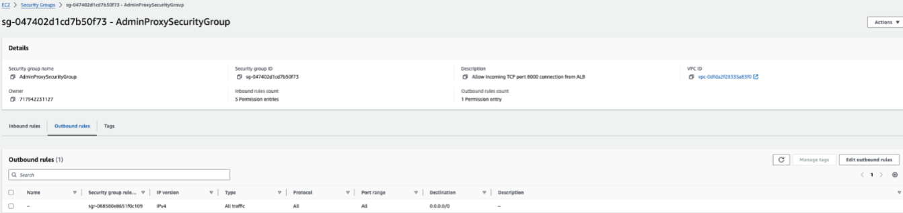

## Create Network Load Balancer
- Create a network load balancer for our VPC, make sure it is internet facing
  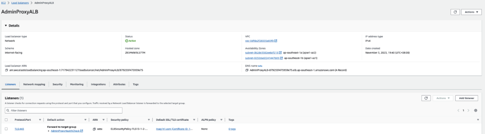

## Create Cloud Map and Services for Service Discovery
- Create Cloud Map Name Space
- Create Service Discovery for ECS Services and take note of the names
  


## ElastiCache Redis Cluster
1) Create ElastiCache Redis Cluster with the following configuration:
   - Cluster Mode: Disabled
   - Fill in the cluster name and description
   - Location: AWS Cloud
   - Multi-AZ: Enabled
2) Cluster Settings:
   - All Default except for:
     - Node Type: cache.t3.micro
3) Take note of the Redis URL under Primary Endpoint:
  

## Elastic Cloud Service
- Set up of ECS Cluster and Services
  - Create IAM Roles:
    - ECSTaskExecution
      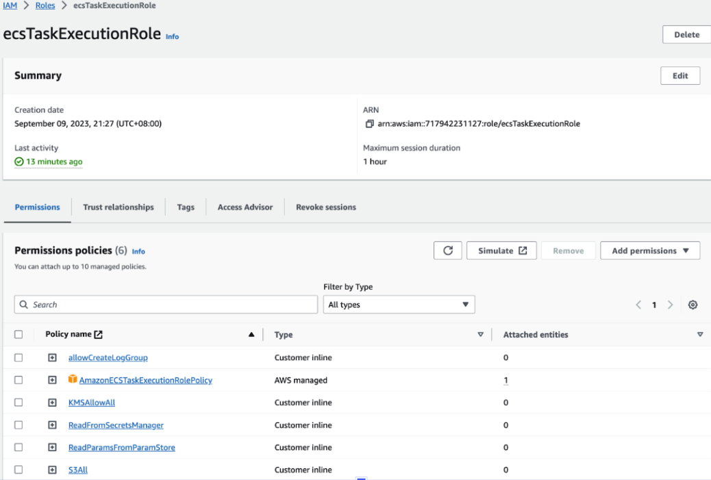

    - ECSTaskRole
      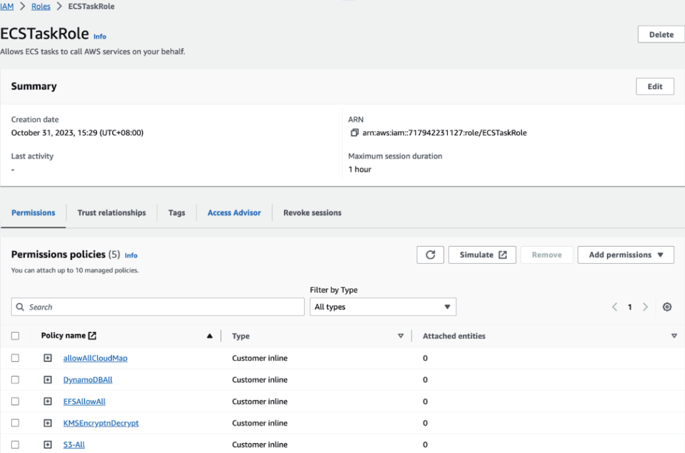
  - Take note of their ARN
  
- Create Secrets in SSM and take note of the ARN:
  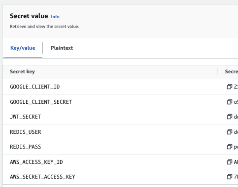

- Create/ Upload ECS Task Definitions for the microservices, look at the `.infra/ecs` folder. Make sure to update the ARNs and URLS where necessary.

- Create ECS Cluster (using CloudFormation Template), look at the `.infra/cloudFormation` folder
  
- Create ECS Services (using CloudFormation Templates), look at the `.infra/cloudFormation` folder

## DynamoDB
1) Our microservices will automatically create tables and seed data into the data on first load. However, these default configuration are not yet optimal.
2) Here are the following tweaks required to be made:
- Enable Global Tables for All Tables
- Enable PITR 
- Configure Auto Scaling Policies
- Enable TTL Index for Logs with attribute `ttl`:


# Setting up Github Actions

- Create IAM Role for Github Action

- Create Identity Token for Github Action